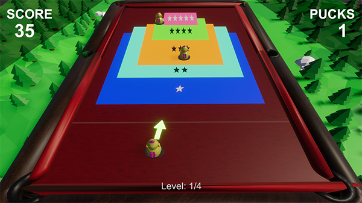

# Finchball (Genshin Impact minigame) by PlayCompile

A simple tabletop game built in Unity as a learning project. This game was developed as a tutorial, focusing on basic Unity concepts, such as 2D physics, UI management, and game state handling.

Part 1: https://www.youtube.com/watch?v=oQxiH6tVM1Q
Part 2: https://www.youtube.com/watch?v=oQxiH6tVM1Q



Top simply play the game, download from the Releases tab!

## Features
- Turn-based gameplay
- Customizable player characters
- Dice roll mechanics
- AI opponents
- Win/Loss conditions

## Installation and Setup (Unity Project)
1. **Clone the repository:**
   ```bash
   git clone https://github.com/PlayCompile/Finchball.git
